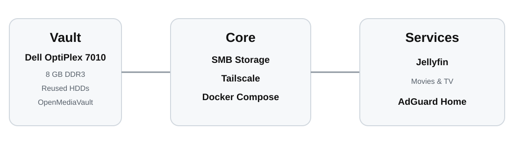

# Vault

Vault is my home NAS project built from an old Dell OptiPlex 7010 that I no longer used.

Instead of buying a dedicated NAS, I decided to reuse the hardware I already had and turn it into a small home server.

## What I built

- OpenMediaVault as the NAS operating system
- Shared storage with SMB
- Tailscale for remote access outside the home network
- Docker Compose for self-hosted services
- Jellyfin for movies and TV shows
- AdGuard Home for DNS filtering

## Journey

The project started with an unused old desktop.

I upgraded the RAM, reused old hard drives, checked their health with S.M.A.R.T., and installed OpenMediaVault.

After the storage was ready, I created shared folders and SMB shares so I could access the NAS from my Mac and other devices.

Then I added Tailscale so I could securely reach Vault from outside my home network.

Next I added Docker Compose to run services without installing everything directly on the host.

Jellyfin turned Vault into my personal media server, with separate libraries for movies and TV shows.

I also added AdGuard Home to experiment with network-level DNS filtering.

## Hardware

- Dell OptiPlex 7010
- 8 GB DDR3 RAM
- Reused HDD storage

## Status

Vault is currently running as my personal NAS and home server.

I plan to keep improving it while learning more about Linux, networking, Docker, and self-hosting.
